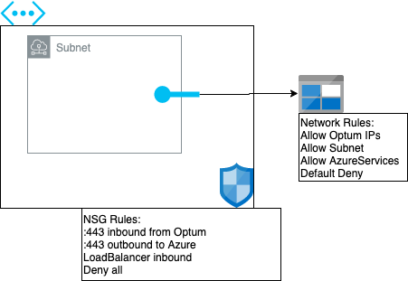

# Azure Starter

**NOTICE: This is not meant for DCE, please use the repository that was created for you in the [redbox github organization] for getting started with DCE**

A starter project for teams looking to utilize public cloud with Terraform.

## Getting Started

1. Ensure [prerequisites] are met
2. Fork this repository
3. Configure Jenkins with either a Multibranch pipeline or a Github organization to pick up the forked repository
4. Configure Jenkins with a credential of type Microsoft Azure Service Principal
5. Run the build on forked repository master branch and you are off to the races!

### What does this project create?

This project lays out a network shell and storage account for compute resources to be deployed within. The architecture can be visualized as outlined below:



## Jenkins Configuration

The `YOUR_Org_namefile.yml` and `Jenkinsfile` are described in the Terraform starter post [found here]

## Running Terraform Locally

### Required Tooling

- [Install Terraform]
- [Install Azure CLI]

### Local Configuration Changes

To run this locally, change `backend.tf` to use "local" rather than "azurerm". `backend.tf` will now look like:

```
terraform {
  backend "local" {}
}
```

> **NOTE:** Do not commit `backend.tf` changes as this will break the jenkins pipeline because each new run of the pipeline would not have access to the previously saved state.

You can validate the terraform plan against all resources by initializing terraform using `-backend=false`:

```
> mv backend.tf backend.tf.bak
> terraform init -backend=false
> terraform plan -var-file=terraform.tfvars
```

Once you have validated the terraform plan, restore the backend.tf file:

```
> mv backend.tf.bak backend.tf
```

### Commands

```bash
$ terraform init
$ terraform plan
$ terraform apply
```

Infrastructure can then be destroyed with:

```bash
$ terraform destroy
```

## Prerequisites

### Obtaining an Azure Subscription

The formal request for public cloud usage within YOUR_Org_name is outlined [here](https://cloud.YOUR_Org_name.com/docs/intake/intake-overview/).

### Set values in `Jenkinsfile`

The Jenkinsfile must be populated with the following values before Jenkins can be run:

* AZURE_CREDENTIALS_ID - See below to get those credentials set up
* TF_BACKEND_ACCOUNT - Globally (within Azure) unique name for the backend storage account

### Set up Azure Service Principal (Automation User for Terraform)

Think of a Service Principal in Azure as an analog to a "Service Account" in the Windows world. All Terraform work will be done as this account. The account can be granted any Azure role, but cannot log into the GUI.

Log into Azure CLI as your named user/account (pay attention to the JSON object returned - we'll use that data for the next step):

```bash
$ az login
```

Create a Service Principal using a unique and meaningful name (if name is omitted, it defaults to "azure-cli-YYYY-MM-DD-HH-MM-SS"). This Service Principal will be created in Azure Active Directory and may be shared across subscriptions. The subscription value below is the "id" from the previous JSON. "Owner" role can do all actions except grant access to other accounts. The JSON object returned contains sensitive information that you will need for the next step:

```bash
$ az ad sp create-for-rbac --name "xxxxxxxx" --role="Owner" --scopes="/subscriptions/xxxxxxxx-xxxx-xxxx-xxxx-xxxxxxxxxxxx"
```

If you already have an existing Azure Active Directory application that you want to associate to the subscription, get the application ID from the portal and run the following:

```bash
az role assignment create --scope /subscriptions/xxxxxxxx-xxxx-xxxx-xxxx-xxxxxxxxxxxx --role "Owner"  --assignee yyyyyyyy-yyyy-yyyy-yyyy-yyyyyyyyyy
```

Log out of Azure CLI (to ensure from now on you're using the service provider instead of your personal credentials)

```bash
$ az logout
```

Export the following environment variables based on the two JSON objects above:

```bash
$ export ARM_CLIENT_ID="APPID_VALUE" # from service principal creation
$ export ARM_CLIENT_SECRET="PASSWORD_VALUE" # from service principal creation
$ export ARM_TENANT_ID="TENANT_VALUE" # from service principal creation
$ export ARM_SUBSCRIPTION_ID="ID_VALUE" # from login
```

Keep the value of the ARM_CLIENT_SECRET/password safe!

References

- [Create Service Principal with Azure CLI](https://docs.microsoft.com/en-us/cli/azure/create-an-azure-service-principal-azure-cli?toc=%2Fazure%2Fazure-resource-manager%2Ftoc.json&view=azure-cli-latest)
